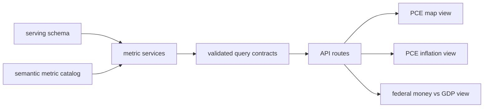

# Metrics Expansion Plan

## Goal

Build the first production-backed metric layer on top of the Phase 0 foundation so the app can answer three concrete questions:

- How do total and per-capita PCE vary across states and categories, with live US aggregates that respond to selected states?
- How has PCE inflation evolved over time for the US and selected states, using year-over-year change as the default storytelling measure?
- How does federal money flowing into a state compare with that state's economic contribution, with transfers and program funding exposed as separate buckets?

## What Already Exists

The repository already has the right foundation for this work:

- Semantic catalog shape in [lib/catalog/types.ts](/home/john/tlg/macro-frontend/lib/catalog/types.ts)
- Starter metric seed in [lib/catalog/seed.ts](/home/john/tlg/macro-frontend/lib/catalog/seed.ts)
- Shared request/response schemas in [lib/contracts/](/home/john/tlg/macro-frontend/lib/contracts)
- Thin service layer in [lib/services/](/home/john/tlg/macro-frontend/lib/services)
- Read-only Postgres configuration in [lib/db/server.ts](/home/john/tlg/macro-frontend/lib/db/server.ts) and [.env.template](/home/john/tlg/macro-frontend/.env.template)

The main gap is that the current metrics and query service are still seed/stub implementations, not serving-backed domain metrics.

## Proposed Metric Families

Start with metric families rather than one-off metrics so the app can scale cleanly.

### 1. PCE Levels

Core semantic measures:

- `pce-total`
- `pce-per-capita`

Required dimensions:

- geography: `nation`, `state`
- time: monthly, quarterly, or annual depending on serving-layer availability
- category: `all`, `food`, `health`, `gas`, `housing`, and any other categories the serving layer can support reliably

Important derived behavior:

- US total should be computed from the national series when available.
- US per-capita average should use `total_pce / population`, not a simple average of state per-capita values.
- When states are selected/deselected, a secondary aggregate should recompute from the selected states only, so the UI can show both `US overall` and `selected states aggregate` when useful.

### 2. PCE Inflation

Core semantic measures:

- `pce-inflation-yoy`
- category-specific variants through a shared category dimension, not separate hard-coded metrics per category

Default transformation:

- year-over-year percent change

Recommended supporting derived measures:

- cumulative inflation since a user-selected start date
- average annualized inflation over a selected range
- contribution comparison helper for phrases like “US food prices averaged X since 2021, but excluding California they averaged Y”

This likely means the metric layer should support transformations in addition to raw stored measures.

### 3. Federal Money vs GDP

Core semantic measures:

- `federal-direct-transfers`
- `federal-program-funding`
- `state-gdp`

Recommended derived comparisons:

- `federal-total-inflows = direct_transfers + program_funding`
- `federal-inflows-to-gdp-ratio`
- optional per-capita versions if population is already available for the PCE work

Because you chose separate buckets by default, the UI should expose transfers and program funding distinctly and allow the comparison view to show them individually plus combined.

## Contract And Domain Changes

The current contracts are too Phase-0-simple for these workflows. Update them in place rather than adding a parallel API shape.

### Catalog shape

Extend [lib/catalog/types.ts](/home/john/tlg/macro-frontend/lib/catalog/types.ts) and seed/catalog helpers so a metric can express:

- backing dataset or semantic family key
- supported dimensions such as `category`, `transform`, `frequency`, `aggregation`
- derivation rules, such as `per_capita`, `ratio`, or `sum_of_components`
- richer caveats and freshness metadata per family

Likely files:

- [lib/catalog/types.ts](/home/john/tlg/macro-frontend/lib/catalog/types.ts)
- [lib/catalog/seed.ts](/home/john/tlg/macro-frontend/lib/catalog/seed.ts)
- [lib/catalog/index.ts](/home/john/tlg/macro-frontend/lib/catalog/index.ts)

### Query contracts

Extend [lib/contracts/query.ts](/home/john/tlg/macro-frontend/lib/contracts/query.ts) and related shared schemas so requests can carry:

- category selection
- frequency selection if the serving layer supports multiple frequencies
- transform selection for inflation and derived comparisons
- optional comparison mode like `include_selected_states_aggregate`
- optional exclusions so statements like “without California” are easy to represent

The response shape should also support:

- multiple aggregate blocks such as `usOverall`, `selectedStatesAggregate`, and `selectionSummary`
- chart-ready series metadata for multi-line and map workflows
- explicit units and transformation labels in display metadata

Likely files:

- [lib/contracts/common.ts](/home/john/tlg/macro-frontend/lib/contracts/common.ts)
- [lib/contracts/query.ts](/home/john/tlg/macro-frontend/lib/contracts/query.ts)
- [lib/contracts/chart-recommendation.ts](/home/john/tlg/macro-frontend/lib/contracts/chart-recommendation.ts)
- [lib/contracts/export.ts](/home/john/tlg/macro-frontend/lib/contracts/export.ts)

### Service layer

Replace the stub logic in [lib/services/query.ts](/home/john/tlg/macro-frontend/lib/services/query.ts) with metric-family-aware query services backed by the DB layer. Prefer separate domain services over one monolith.

Likely split:

- [lib/services/query.ts](/home/john/tlg/macro-frontend/lib/services/query.ts) becomes orchestration
- new domain helpers under `lib/services/` or `lib/domain/` for:
  - PCE levels
  - PCE inflation transforms
  - federal inflows
  - GDP
  - aggregation utilities

## Database Exploration And Mapping

Because the serving-layer table names are not yet encoded in the repo, begin execution with a schema-mapping pass against the read-only DB.

Implementation note: the completed build maps Phase 1 to five serving objects:

- `obt_state_macro_annual_latest` for annual state PCE levels, GDP, and resident population rows,
- `v_macro_yoy` as a reference view, although the implemented category growth logic derives year-over-year change from raw PCE levels directly,
- `v_pce_state_per_capita_annual` was inspected but not trusted because it over-joins Census rows and duplicates population values,
- `v_state_federal_to_persons_gdp_annual` for direct federal transfers to persons,
- `v_state_federal_to_stategov_gdp_annual` for federal program funding to state governments.

The serving layer currently does not expose true state-category PCE price indexes, so the implementation ships:

- all-items implicit PCE inflation for the inflation workflow,
- category-level nominal PCE growth for food, gas, housing, health, and food services,
- explicit metadata and UI caveats explaining that distinction.

Deliverables from that pass:

- identify the authoritative serving views/tables for PCE levels by state and US
- identify how PCE categories are encoded and which category hierarchy is feasible for v1
- identify the source series needed to compute PCE inflation year-over-year
- identify the population series needed for per-capita calculations
- identify GDP availability by state and year
- identify federal transfer/program-funding surfaces and how to distinguish the two buckets
- document any missing pieces that need semantic fallbacks or deferred scope

If the serving layer does not already expose exactly the needed derived series, prefer deriving them in app services first instead of blocking on warehouse changes, as long as the logic stays explicit and testable.

## UI Workflows To Build

### 1. PCE map workflow

Build a state map workflow that supports:

- metric toggle between total and per-capita PCE
- category selector
- state selection and deselection
- visible US overall summary plus selected-states aggregate summary
- synchronized map, legend, and table/detail readout

Likely surface files:

- query/explorer route under `app/`
- chart/map components under `components/`
- metadata panel reused from the existing foundation

### 2. PCE inflation storytelling workflow

Build a line or multi-line workflow that supports:

- default year-over-year inflation transformation
- category selector
- one or multiple state selections plus US
- exclusion-aware comparisons for statements like “excluding California”
- summary statistics for the selected period, not just raw plotted values

### 3. Federal money vs GDP workflow

Build a comparison workflow that supports:

- state selection
- last-year default time range
- separate bars or table columns for direct transfers, program funding, combined inflows, and GDP
- ratio or share label to make the comparison interpretable

## Recommended Additional Metrics

To make these workflows more durable, add a few prudent supporting metrics now:

- `population` for state and US per-capita normalization
- `pce-category-share` to show category spending as a share of total PCE where useful
- `federal-inflows-per-capita` for cross-state comparisons
- `gdp-per-capita` if it comes almost for free from the same sources

These should be added only if the serving layer already exposes the raw inputs or they are straightforward app-level derivations.

## Validation Strategy

Update and expand tests so the metric layer is safe to extend.

Files likely affected:

- [tests/catalog.test.ts](/home/john/tlg/macro-frontend/tests/catalog.test.ts)
- [tests/contracts.test.ts](/home/john/tlg/macro-frontend/tests/contracts.test.ts)
- [tests/export.test.ts](/home/john/tlg/macro-frontend/tests/export.test.ts)
- new service-level tests for aggregation and transformation logic

Validation should cover:

- catalog metadata for new metric families
- contract validation for category/transform/comparison inputs
- year-over-year inflation calculations
- selected-state aggregate recomputation
- federal-inflows bucket logic and combined totals
- export parity with visible query results

## Execution Order

1. Inspect the `serving` schema and write down the concrete backing surfaces for PCE, population, GDP, and federal inflows.
2. Expand the semantic metric catalog to model metric families, dimensions, and derivations.
3. Upgrade shared request/response contracts to carry category, transform, and aggregate semantics.
4. Implement serving-backed query services and aggregation utilities.
5. Build the three user workflows: PCE map, PCE inflation lines, and federal money vs GDP comparison.
6. Add tests, docs, and validation evidence.

## Key Risks

- PCE category names in the serving layer may not map neatly to UI labels like `gas` or `housing`.
- State-level inflation may exist only for some frequencies or category subsets, which may force a narrower first release.
- Federal spending data may not separate direct transfers and program funding cleanly enough for a strict first-pass semantic split.
- The current query contract may need meaningful changes, so API/UI alignment must be handled carefully.

## Acceptance Criteria

- The catalog includes production-ready semantic metric families for PCE levels, PCE inflation, federal inflows, GDP, and any required support metrics.
- The query layer can answer the three requested workflows using validated contracts backed by the serving layer.
- The PCE map supports total/per-capita toggles, category selection, state selection, and aggregate recomputation.
- The inflation workflow supports US plus selected states with year-over-year PCE inflation and exclusion-aware comparison summaries.
- The federal money workflow supports direct transfers, program funding, combined inflows, GDP, and interpretable comparison labels.
- Tests and docs cover the new metric semantics and query behavior.

## Architecture Sketch

