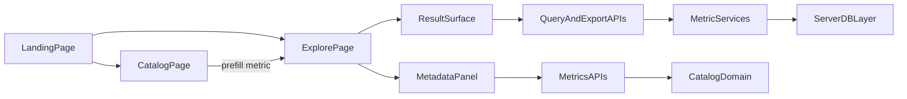

# Roadmap Phase 1 MVP Plan

## Goal

Ship the first complete end-to-end user workflow described in [.agent/ROADMAP.md](/home/john/tlg/macro-frontend/.agent/ROADMAP.md): users can land in the product, discover metrics, inspect metadata, configure a view, see results in supported visual forms, and export the exact filtered result.

## Assumptions

- Treat the current live data work as reusable Phase 1 building blocks, not throwaway demos. The existing services in [lib/services/query.ts](/home/john/tlg/macro-frontend/lib/services/query.ts), [lib/services/pce-metrics.ts](/home/john/tlg/macro-frontend/lib/services/pce-metrics.ts), and [lib/services/federal-metrics.ts](/home/john/tlg/macro-frontend/lib/services/federal-metrics.ts) remain the initial domain backbone.
- Move from the current single-page dashboard in [app/page.tsx](/home/john/tlg/macro-frontend/app/page.tsx) and [components/metrics-dashboard.tsx](/home/john/tlg/macro-frontend/components/metrics-dashboard.tsx) to a discovery-first information architecture that matches the required surfaces in [.agent/SPEC.md](/home/john/tlg/macro-frontend/.agent/SPEC.md).

## Current Baseline

Already in place:

- Validated server contracts and APIs in [app/api/query/route.ts](/home/john/tlg/macro-frontend/app/api/query/route.ts), [app/api/export/route.ts](/home/john/tlg/macro-frontend/app/api/export/route.ts), [app/api/metrics/search/route.ts](/home/john/tlg/macro-frontend/app/api/metrics/search/route.ts), and [app/api/metrics/[metricId]/route.ts](/home/john/tlg/macro-frontend/app/api/metrics/[metricId]/route.ts).
- Semantic catalog and metadata model in [lib/catalog/types.ts](/home/john/tlg/macro-frontend/lib/catalog/types.ts), [lib/catalog/seed.ts](/home/john/tlg/macro-frontend/lib/catalog/seed.ts), and [lib/catalog/index.ts](/home/john/tlg/macro-frontend/lib/catalog/index.ts).
- Shared query shape already supports rows, series, aggregates, warnings, and empty-state reasons in [lib/contracts/query.ts](/home/john/tlg/macro-frontend/lib/contracts/query.ts).
- Basic result renderers already exist in [components/state-tile-map.tsx](/home/john/tlg/macro-frontend/components/state-tile-map.tsx), [components/simple-bar-chart.tsx](/home/john/tlg/macro-frontend/components/simple-bar-chart.tsx), and [components/simple-line-chart.tsx](/home/john/tlg/macro-frontend/components/simple-line-chart.tsx).

Main gaps against the roadmap:

- No distinct landing page with guided entry points.
- No metric catalog/search UI, despite API support.
- No reusable metadata panel.
- No generic explorer/query-builder surface with view switching.
- No URL-backed query state.
- Frontend export UI only exposes CSV even though [lib/services/export.ts](/home/john/tlg/macro-frontend/lib/services/export.ts) supports XLSX.
- Empty-state rendering is inconsistent even though the response contract includes `emptyStateReason`.

## Target MVP Architecture

## Workstreams

### 1. Lock the MVP route structure

Create the required product surfaces instead of keeping everything inside the current home page.

- Convert [app/page.tsx](/home/john/tlg/macro-frontend/app/page.tsx) into a true landing page with guided entry points such as browse metrics, start exploring, and a few curated starter flows.
- Add [app/catalog/page.tsx](/home/john/tlg/macro-frontend/app/catalog/page.tsx) for metric discovery.
- Add [app/explore/page.tsx](/home/john/tlg/macro-frontend/app/explore/page.tsx) for builder plus results.
- Update [app/layout.tsx](/home/john/tlg/macro-frontend/app/layout.tsx) with lightweight shared navigation so discovery and analysis feel like one product.
- Either retire or heavily decompose [components/metrics-dashboard.tsx](/home/john/tlg/macro-frontend/components/metrics-dashboard.tsx) into smaller product components instead of leaving it as the primary surface.

### 2. Build the catalog and discovery experience

Use the existing semantic catalog and search endpoints as the user-facing discovery layer.

- Create a catalog UI component set such as `metric-catalog`, `metric-card`, and search/filter controls under [components/](/home/john/tlg/macro-frontend/components).
- Drive metric search from [app/api/metrics/search/route.ts](/home/john/tlg/macro-frontend/app/api/metrics/search/route.ts) and expose category browsing from [lib/catalog/index.ts](/home/john/tlg/macro-frontend/lib/catalog/index.ts).
- Show plain-English fields already present in [lib/catalog/seed.ts](/home/john/tlg/macro-frontend/lib/catalog/seed.ts): display name, short description, unit, supported chart types, freshness, and status.
- Allow users to jump from a catalog card into `/explore` with a prefilled metric selection.

### 3. Add a reusable metadata panel

Turn the existing metadata model into a first-class UI surface.

- Build a reusable component such as [components/metadata-panel.tsx](/home/john/tlg/macro-frontend/components/metadata-panel.tsx).
- Populate it from [app/api/metrics/[metricId]/route.ts](/home/john/tlg/macro-frontend/app/api/metrics/[metricId]/route.ts) and/or direct server access to [lib/catalog/index.ts](/home/john/tlg/macro-frontend/lib/catalog/index.ts), depending on whether the consuming surface is client or server rendered.
- Standardize the panel to show definition, source, unit, freshness, allowed chart types, and caveats so the roadmap’s “trust” requirement is visible near results and in catalog browsing.
- Replace ad hoc caveat text in [components/metrics-dashboard.tsx](/home/john/tlg/macro-frontend/components/metrics-dashboard.tsx) with the reusable panel where possible.

### 4. Build the explorer and guided query builder

Replace the current hard-coded workflow page with a generic explorer that still supports the existing PCE and federal presets.

- Create a reusable builder component such as [components/query-builder.tsx](/home/john/tlg/macro-frontend/components/query-builder.tsx) that maps catalog metadata and dimensions from [lib/catalog/types.ts](/home/john/tlg/macro-frontend/lib/catalog/types.ts) and [lib/catalog/seed.ts](/home/john/tlg/macro-frontend/lib/catalog/seed.ts) into form controls.
- Use [lib/contracts/query.ts](/home/john/tlg/macro-frontend/lib/contracts/query.ts) as the single source of truth for request shape; extend it only if view selection or comparison semantics cannot be expressed cleanly with the current contract.
- Support metric, geography, time range, comparison mode, and view selection with sensible defaults and chart recommendations from [app/api/chart-recommendation/route.ts](/home/john/tlg/macro-frontend/app/api/chart-recommendation/route.ts).
- Reframe the current PCE map, trend story, and federal comparison flows as starter presets inside `/explore`, rather than as the entire app IA.

### 5. Create a reusable result surface

Standardize result rendering so every supported Phase 1 view is handled consistently.

- Add a shared result surface component such as [components/result-surface.tsx](/home/john/tlg/macro-frontend/components/result-surface.tsx) that can render table, bar, line, multi-line, and map based on `display.recommendedChart`, supported chart types, and user-selected view.
- Reuse the existing chart primitives in [components/simple-bar-chart.tsx](/home/john/tlg/macro-frontend/components/simple-bar-chart.tsx), [components/simple-line-chart.tsx](/home/john/tlg/macro-frontend/components/simple-line-chart.tsx), and [components/state-tile-map.tsx](/home/john/tlg/macro-frontend/components/state-tile-map.tsx).
- Add a clear table renderer so `table` is always available where the contract allows it.
- Render `warnings`, `display.notes`, and `emptyStateReason` consistently so loading, empty, and error states are all explicit.

### 6. Preserve useful state in the URL

Make the explorer shareable and refresh-safe.

- Parse `searchParams` in [app/explore/page.tsx](/home/john/tlg/macro-frontend/app/explore/page.tsx) and mirror builder state into the URL.
- Add a focused serializer/parser utility under [lib/](/home/john/tlg/macro-frontend/lib) for stable query-string encoding of metric, geography, time range, comparison mode, and selected view.
- Ensure catalog-to-explorer links prefill the same URL state shape.
- Keep the URL schema simple and explicit so direct links remain durable.

### 7. Finish export parity

Match the roadmap requirement that exports reflect the exact filtered result set.

- Add CSV and XLSX export actions to the new result surface using [app/api/export/route.ts](/home/john/tlg/macro-frontend/app/api/export/route.ts).
- Ensure exports use the same request payload currently driving the visible result.
- Surface export loading and failure states alongside the main query state.

### 8. Validation and documentation

Close the MVP with evidence, not just implementation.

- Extend [tests/contracts.test.ts](/home/john/tlg/macro-frontend/tests/contracts.test.ts) for any query-state or contract additions.
- Add focused tests for catalog search helpers in [tests/catalog.test.ts](/home/john/tlg/macro-frontend/tests/catalog.test.ts) and export parity in [tests/export.test.ts](/home/john/tlg/macro-frontend/tests/export.test.ts).
- Add component or state-logic coverage for URL parsing/serialization and result-surface empty-state handling.
- Update [README.md](/home/john/tlg/macro-frontend/README.md) to describe the MVP routes, workflow, and export behavior.
- Record the cross-cutting execution plan in [.agent/PLANS.md](/home/john/tlg/macro-frontend/.agent/PLANS.md) before implementation begins, since this work changes routing, navigation, query state, and product surfaces together.

## Acceptance Criteria

Phase 1 MVP is complete when:

- `/` acts as a real landing page with guided entry points.
- `/catalog` lets users search and browse metrics by category with plain-English descriptions.
- `/explore` supports a guided builder for metric, geography, time range, comparison mode, and view selection.
- Users can render results as table, bar, line, multi-line, and map when the selected metric supports them.
- The metadata panel is reusable and shows definition, source, unit, freshness, and caveats.
- CSV and XLSX exports both reflect the exact filtered result shown in the UI.
- Loading, empty, and error states are explicit across catalog, query, and export flows.
- Explorer state survives refresh and direct linking via the URL.
- Docs and tests are updated to match the shipped MVP behavior.