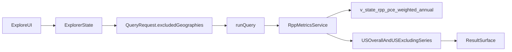

# RPP Exclusion Metric Plan

## Why This Fits The Current App

The app already has most of the plumbing needed for this feature:

- `[lib/contracts/query.ts](lib/contracts/query.ts)` already supports `excludedGeographies` in the shared query contract.
- `[lib/explore-state.ts](lib/explore-state.ts)` already parses and serializes `excludedStates`, but only forwards them for `pce-growth-yoy` and `pce-inflation-yoy`.
- `[components/query-builder.tsx](components/query-builder.tsx)` already renders a multi-select for excluded states, but disables it unless the metric is treated as a trend metric.
- `[lib/services/query.ts](lib/services/query.ts)` already routes metric families into dedicated builders, so this new view can slot in cleanly as a new service instead of being bolted onto unrelated PCE logic.

## Implementation Shape

### 1. Add A New Metric Family For Annual Price Levels

Create a new metric entry in `[lib/catalog/seed.ts](lib/catalog/seed.ts)` for the annual weighted national price-level comparison backed by `v_state_rpp_pce_weighted_annual`.

Recommended first-pass shape:

- Metric family: new family such as `rpp-price-levels`
- Metric intent: national weighted price level with optional state exclusions
- Default charts: `table`, `bar`, `line`, `multi_line`
- Geography behavior: driven by state inclusion/exclusion controls, but the primary output is national comparison series rather than a state map
- Backing metadata: store `viewName: "v_state_rpp_pce_weighted_annual"` plus category notes/caveats

Also update `[lib/catalog/types.ts](lib/catalog/types.ts)` and any summary helpers only if the new metric needs extra semantic metadata beyond the existing catalog shape.

## 2. Broaden Category Handling Before Wiring The View

This is the biggest likely schema change.

Today the query contract hardcodes a narrow category enum in `[lib/contracts/common.ts](lib/contracts/common.ts)` and mirrors that assumption in `[lib/explore-state.ts](lib/explore-state.ts)`. That works for the current `food`, `gas`, `housing`, `health`, and `food_services` set, but it will likely break if the new view exposes more specific buckets like rents or utilities.

Plan for one of these, depending on the view schema:

- If the view’s category IDs align with current IDs, reuse the existing enum.
- If the view exposes new category IDs, relax the contract so category is validated against catalog-backed options instead of a fixed global enum.

That change would likely touch:

- `[lib/contracts/common.ts](lib/contracts/common.ts)`
- `[lib/contracts/query.ts](lib/contracts/query.ts)`
- `[lib/explore-state.ts](lib/explore-state.ts)`
- `[components/query-builder.tsx](components/query-builder.tsx)`

## 3. Add A Dedicated Query Service For The New View

Implement a new service, likely `[lib/services/rpp-metrics.ts](lib/services/rpp-metrics.ts)`, instead of overloading `[lib/services/pce-metrics.ts](lib/services/pce-metrics.ts)`.

Responsibilities:

- Read rows from `v_state_rpp_pce_weighted_annual`
- Filter by requested category and year range
- Build the baseline `US overall` series/value
- Recompute a second national series/value with `excludedGeographies` removed
- Return chart-ready rows/series/aggregate cards in the same `QueryResponse` shape used elsewhere
- Label the derived comparison clearly, for example `US excluding CA, TX`

Then update `[lib/services/query.ts](lib/services/query.ts)` so the new metric family routes to this service.

## 4. Reuse The Existing Explorer Instead Of Building A New Surface

Add this metric to the existing `/explore` workflow rather than creating a separate page.

Implementation tasks:

- Replace the current `isTrendMetric()` gate in `[lib/explore-state.ts](lib/explore-state.ts)` with a capability helper such as `supportsExcludedStates(metricId)`.
- Use the same helper in `[components/query-builder.tsx](components/query-builder.tsx)` so the excluded-states control is enabled for the new metric.
- Update metric-scoped defaults in `[lib/explore-state.ts](lib/explore-state.ts)` so the new metric opens with a sensible recent annual window and `selected_plus_us` aggregation.
- Add an explorer preset in `[lib/explore-config.ts](lib/explore-config.ts)` for a starter workflow like “National price level without selected states”.

This keeps URL-backed sharing, export, chart selection, and metadata working without inventing a second configuration model.

## 5. Shape The Result For The User Question

The result should directly answer: “What would the national price of rents, utilities, etc. be without certain states?”

Recommended response shape from the service:

- Aggregate card: latest `US overall`
- Aggregate card: latest `US excluding selected states`
- Aggregate card: delta or percent gap between the two if easy to interpret
- Series: one line for `US overall`, one line for the exclusion scenario, plus optional selected-state lines only if the view supports and the UX benefits from them
- Subtitle/notes: explain that this is a weighted annual national price-level recomputation from the serving view, not nominal spending growth

## 6. Validation And Tests

Add focused coverage around the new path:

- `[tests/explore-state.test.ts](tests/explore-state.test.ts)`: verify the new metric preserves `excludedStates` through parse/serialize/build-request.
- Catalog/contracts tests: confirm the new metric is discoverable and validates correctly.
- New service tests: verify category filtering, exclusion math, aggregate labels, and empty-state behavior.
- Optional export/API parity checks: ensure the derived exclusion scenario exports exactly what the user sees.

## Risks And Early Checks

- The new view may expose category IDs that do not match the current global category enum.
- The view may only expose state rows, which means `US overall` must be recomputed in-app rather than read directly.
- The view may be annual-only, so map support is probably not appropriate for v1 even if other metrics use it.
- If the view returns both weighted components and already-aggregated national values, the service should choose one authoritative path and document it clearly.

## Suggested Execution Order

1. Inspect `v_state_rpp_pce_weighted_annual` and document its columns, category vocabulary, and year coverage.
2. Add the new catalog metric and, if needed, broaden category validation beyond the current fixed enum.
3. Implement `lib/services/rpp-metrics.ts` and route the new metric through `[lib/services/query.ts](lib/services/query.ts)`.
4. Generalize the excluded-states gating in explorer state and query-builder UI.
5. Add a preset, aggregate cards, and explanatory notes tuned to the national-without-states question.
6. Add tests for request shaping, service output, and exclusion math.

## Architecture Sketch

